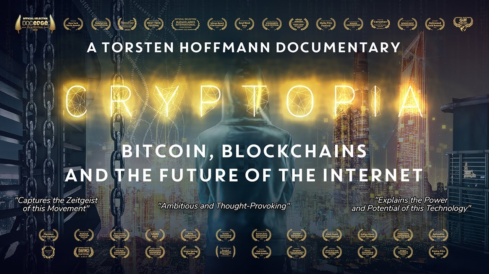

# Awesome Web3 Documentaries

A curated list of documentaries about Web3 and blockchain technology.

## ✨Cryptopia: Bitcoin, Blockchain and the Future of the Internet
This documentary has won more than a dozen awards at international film festivals. Five years after his first Bitcoin documentary, award-winning producer/director Torsten Hoffmann revisits the topic and sets out to explore the evolution of the blockchain industry and its new lofty promises. Can this technology, designed to operate independent of trust and within a decentralized network, really provide a robust alternative to the Internet as we know it (web3.0)? 

[🎬 Watch Now](https://youtu.be/P6vYyqHG54Y)

- **The Blockchain and Us** - Features interviews with experts in the blockchain space, including Ethereum founder Vitalik Buterin, and explores the potential of blockchain technology to revolutionize society.

- **Cryptopia: Bitcoin, Blockchains, and the Future of the Internet** - Explores the impact of cryptocurrencies and blockchain technology on society, including their potential to disrupt traditional power structures.

- **The Rise and Rise of Bitcoin** - Traces the history of Bitcoin, from its early beginnings to its rise as a global phenomenon.

- **Bitcoin: The End of Money as We Know It** - Explores the impact of Bitcoin and blockchain technology on traditional banking and finance systems, and how they could transform our economy.

- **The Bitcoin Gospel** - Examines the potential of Bitcoin and blockchain technology to change the world, and how they could be used to create a more equitable society.

- **Life on Bitcoin** - Follows a couple as they attempt to live solely on Bitcoin for 100 days, showcasing the challenges and opportunities of using cryptocurrency in everyday life.

- **Banking on Bitcoin** - Explores the rise of Bitcoin and its impact on the financial industry, featuring interviews with experts and early adopters of the cryptocurrency.

- **The Blockchain Revolution** - Explores the potential of blockchain technology to transform industries like finance, healthcare, and more, featuring interviews with leading experts in the space.

- **The End of Money** - Examines the potential of cryptocurrencies like Bitcoin to disrupt traditional financial systems, and how they could be used to create a more democratic and equitable world.

These documentaries provide a great introduction to Web3 and blockchain technology, and showcase the potential of these technologies to transform industries and create a more equitable society.

## Contributing

If you would like to contribute to this list, please submit a pull request.