# Awesome Web3 Documentaries

A curated list of documentaries about Web3 and blockchain technology.

## [🎬 Cryptopia: Bitcoin, Blockchain and the Future of the Internet](https://youtu.be/P6vYyqHG54Y)
_🍿This documentary has won more than a dozen awards at international film festivals. Five years after his first Bitcoin documentary, award-winning producer/director Torsten Hoffmann revisits the topic and sets out to explore the evolution of the blockchain industry and its new lofty promises. Can this technology, designed to operate independent of trust and within a decentralized network, really provide a robust alternative to the Internet as we know it (web3.0)?🍿_

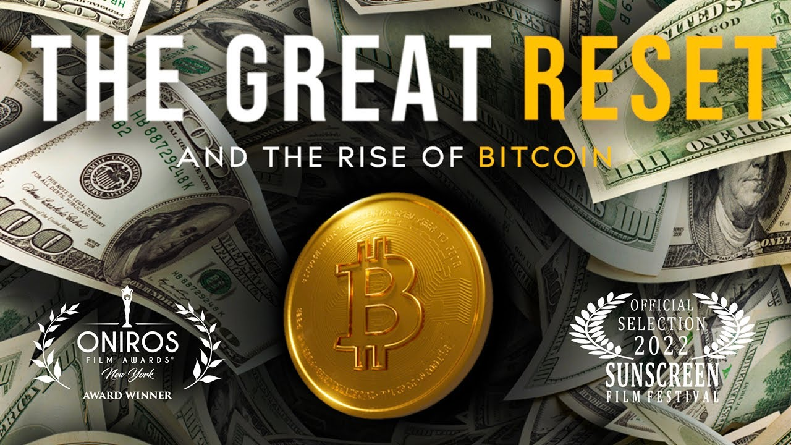
## [🎬 The Great Reset and The Rise of Bitcoin, Bitcoin Explained, Monetary System](https://youtu.be/MOm_QmnRBSs)
_🍿This Film is a documentary that explores the current state of our economy and the impact a new monetary system like Bitcoin can have on the world.🍿_

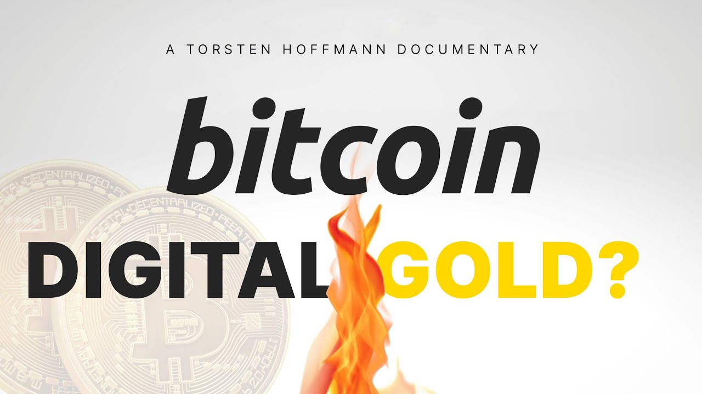
## [🎬 Bitcoin: Digital Gold? Decentralised Alternative, Bitcoin Movie, Currencies](https://youtu.be/ftifwiNQQBc)
_🍿Documentary on the History of Money and Bitcoin as decentralised alternative: Bitcoin: Digital Gold? - An updated version of the critically acclaimed documentary 'Bitcoin: The End of Money'.🍿_

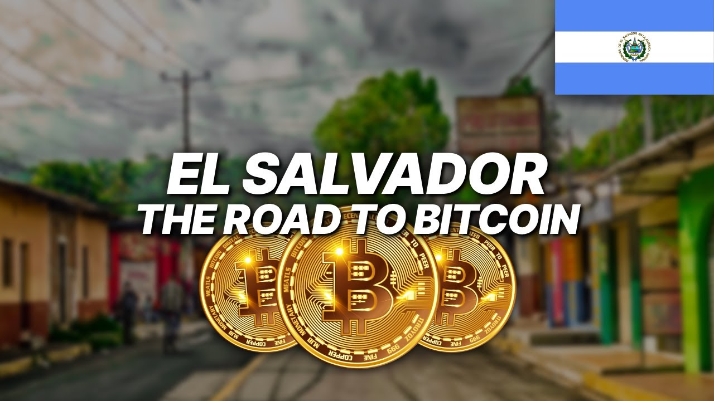
## [🎬 El Salvador - The Road to Bitcoin, Bitcoin as Official Currency, Bitcoin City, Cryptocurrency](https://youtu.be/kuRxbgqRrgY)
_🍿In September 2021, El Salvador became the first country in the world to adopt bitcoin as legal tender.🍿_

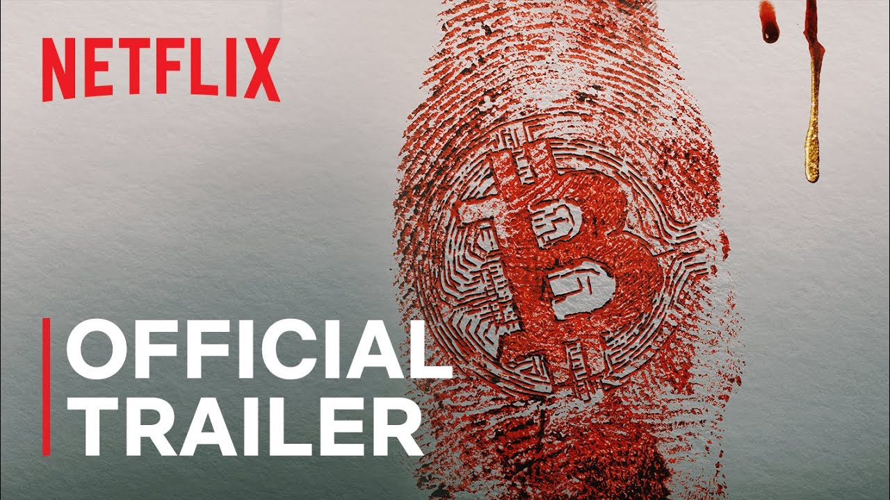
## [🎬 Trust No One: The Hunt for the Crypto King](https://www.netflix.com/in/title/81349029)
_🍿When the young founder of a collapsing cryptocurrency exchange dies unexpectedly, irate investors suspect there's more to his death than meets the eye.🍿_

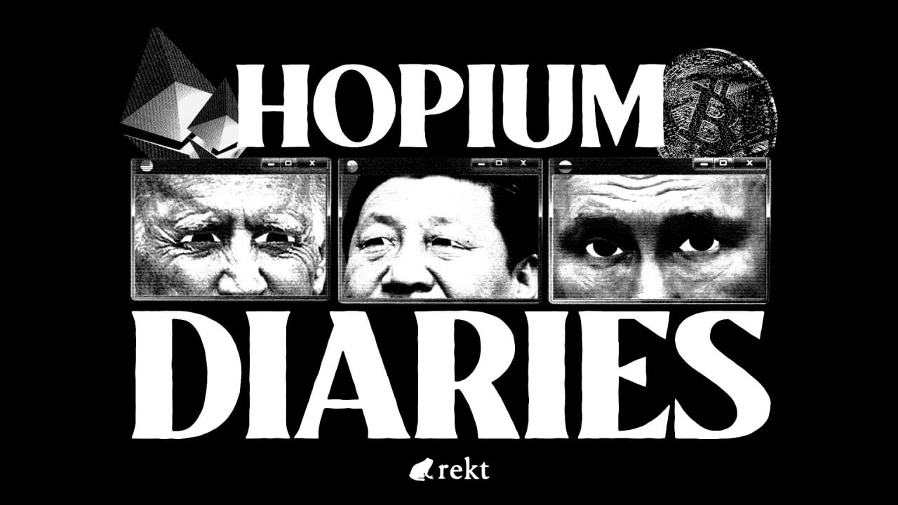
## [🎬 Hopium Diaries - Dystopian Dreams](https://youtu.be/v1Z5BnBuFyE)
_🍿The fire is growing, and a new financial world is emerging. Follow our anonymous author into a future of finance. Not one that will be but one that might be.🍿_

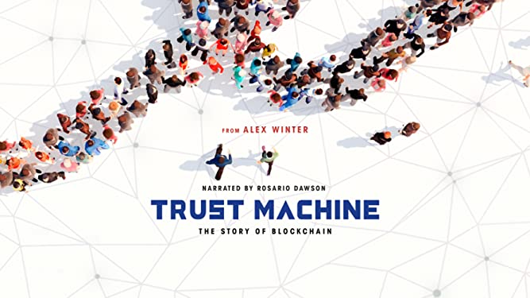
## [🎬 Trust Machine: The Story of Blockchain](https://www.imdb.com/title/tt7407496/)
_🍿TRUST MACHINE is the first blockchain-funded, blockchain-distributed, and blockchain-focused documentary, from entertainment tech company SingularDTV and Futurism Studios. The feature documentary explores the evolution of cryptocurrency, blockchain and decentralization, including the technology's role in addressing important real-world problems, such as world hunger and income inequality.🍿_

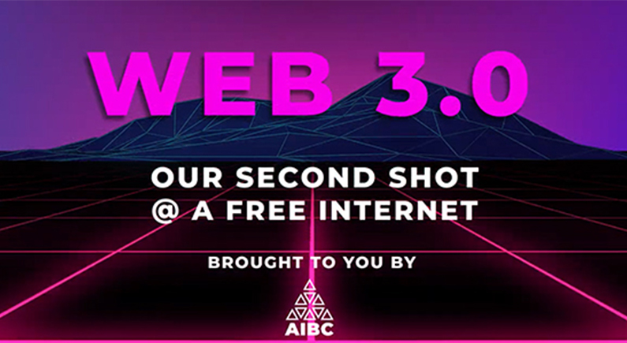
## [🎬 Web3.0 - Our Second Shot At A Free Internet: AIBC Documentary](https://youtu.be/Yufpj9JHJDM)
_🍿In AIBC College’s Grand Debut, the AIBC Team scours both our elite network of technologists as well as the history of the Internet’s evolution in order to discover how Web 3.0 stands a chance to be our last shot at a free and fair internet.🍿_

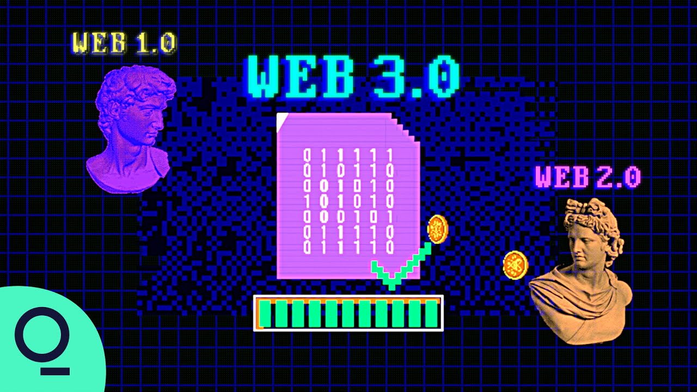
## [🎬 From Bitcoin to DeFi (in 12 Short Years)](https://youtu.be/dM8DAIAx124)
_🍿Even if you’ve been living under a rock, you’re probably familiar with Bitcoin. Now, just as crypto disrupted the concept of value, decentralized finance is poised to disrupt finance itself. The populist movement promises huge returns for daring investors. But with DeFi’s promise of inclusion comes risk and uncertainty.🍿_

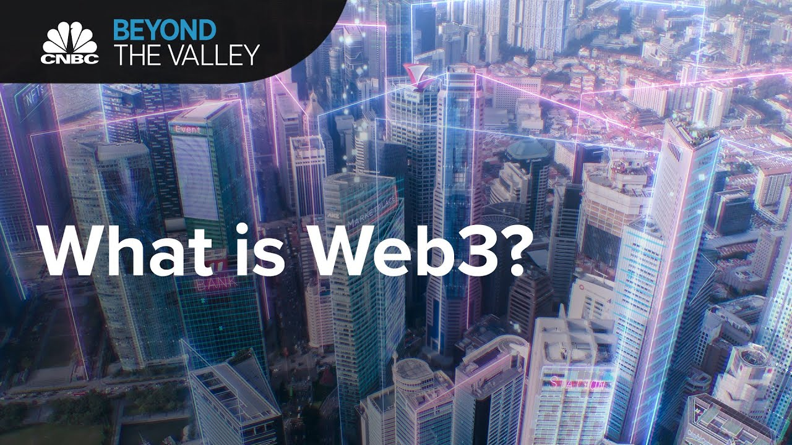
## [🎬 What is Web3? We ask the man who invented the word](https://youtu.be/_b_X2cqNKPE)
_🍿Gavin Wood coined the term Web3 in 2014 to describe the future of the internet. If it becomes a reality, Web3 could change the internet as we know it.🍿_

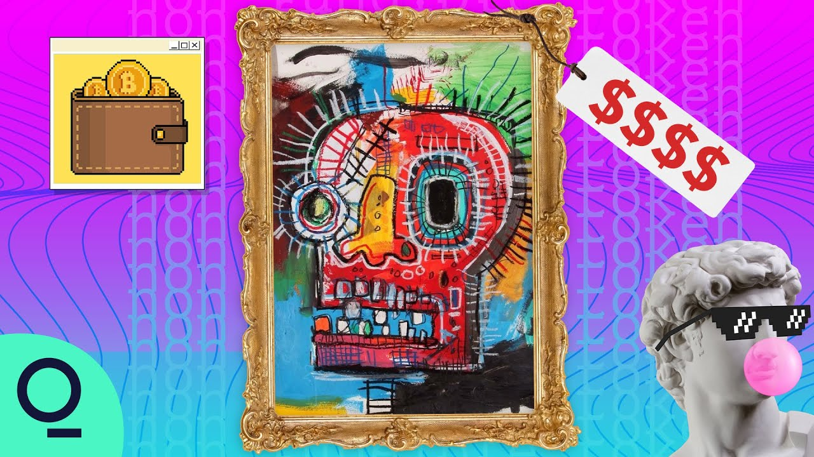
## [🎬 How NFTs Have Become a Gateway Into the Metaverse](https://youtu.be/wU7CTDVHHN8)
_🍿NFTs (non-fungible tokens) burst on the scene with a $69 million sale of Beeple’s digital art. Now players behind the so-called metaverse are betting 'digital scarcity' will create a whole new ecosystem of play and commerce.🍿_

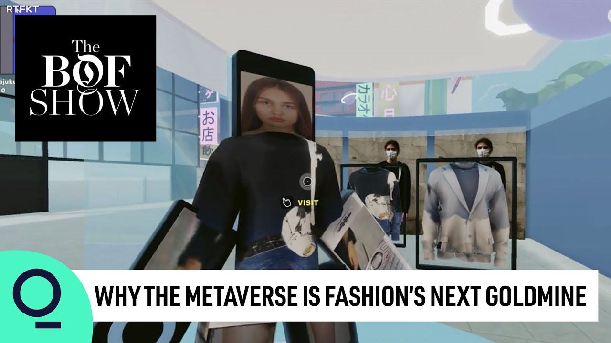
## [🎬 Why the Metaverse Is Fashion's Next Goldmine, The Business of Fashion Show](https://youtu.be/UBZ6Bd0LDjs)
_🍿Founder and CEO of The Business of Fashion Imran Amed steps into the virtual realm with the pioneering entrepreneurs behind Ledger, The Dematerialised and RFTKT Studios to discover why the metaverse is being seen as the next fashion goldmine.🍿_

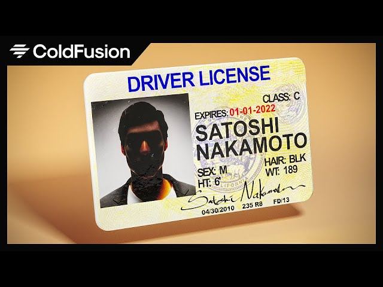
## [🎬 Satoshi Nakamoto and the Civil-War Within Bitcoin](https://youtu.be/iYn6EQDqTkU)
_🍿ColdFusion is an Australian based online media company independently run by Dagogo Altraide since 2009. Topics cover anything in science, technology, history and business in a calm and relaxed environment.🍿_

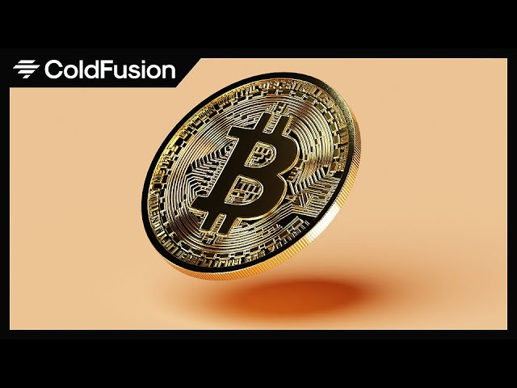
## [🎬 Where Did Bitcoin Come From? – The True Story](https://youtu.be/W15A7Lf0_fI)
_🍿ColdFusion is an Australian based online media company independently run by Dagogo Altraide since 2009. Topics cover anything in science, technology, history and business in a calm and relaxed environment.🍿_

<!-- - **The Blockchain and Us** - Features interviews with experts in the blockchain space, including Ethereum founder Vitalik Buterin, and explores the potential of blockchain technology to revolutionize society.

- **The Rise and Rise of Bitcoin** - Traces the history of Bitcoin, from its early beginnings to its rise as a global phenomenon.

- **Bitcoin: The End of Money as We Know It** - Explores the impact of Bitcoin and blockchain technology on traditional banking and finance systems, and how they could transform our economy.

- **The Bitcoin Gospel** - Examines the potential of Bitcoin and blockchain technology to change the world, and how they could be used to create a more equitable society.

- **Life on Bitcoin** - Follows a couple as they attempt to live solely on Bitcoin for 100 days, showcasing the challenges and opportunities of using cryptocurrency in everyday life.

- **Banking on Bitcoin** - Explores the rise of Bitcoin and its impact on the financial industry, featuring interviews with experts and early adopters of the cryptocurrency.

- **The Blockchain Revolution** - Explores the potential of blockchain technology to transform industries like finance, healthcare, and more, featuring interviews with leading experts in the space.

- **The End of Money** - Examines the potential of cryptocurrencies like Bitcoin to disrupt traditional financial systems, and how they could be used to create a more democratic and equitable world. -->

---

These documentaries provide a great introduction to Web3 and blockchain technology, and showcase the potential of these technologies to transform industries and create a more equitable society.

## Contributing 🧑‍💻

If you would like to contribute to this list, please submit a pull request.